# Mobile User Indoor-Outdoor Detection through Physical Daily Activities  
## 1. Introduction

Indoor-outdoor(IO) sensing methods: 

* GPS-based: 利用GPS信号在室内衰弱的原理；缺点：GPS传感器耗能太大
* smartphone sensor-based：多传感器数据融合的原理；缺点：判断依据太多，容易导致错误判断。

本文工作：

1. 介绍一种通用可行的方法，该方法利用智能手机的内置惯性测量传感器（IMU），而无需任何其他设施即可在野外检测用户IO状态 ；
2. 由于每个人使用手机的风格不同，并且一天中的活动状态都不同，因此为了用户IO识别，将分析数据不平衡的影响；
3. 为了测量特征的敏感性和可辨性，深入了解降维对每个活动数据集中检测器识别的影响。

本文结构：

1. 全文介绍
2. related works
3. 描述提出方法的关键点
4. 描述方法细节
5. 简略的介绍分类方法
6. & 7. & 8. 结论及建议

## 2. Related Work

现在存在的一些方法和其限制点：

* Light and sound approaches: 声音或光线的强度可能会随时间变化，并且可能会受到各种因素的影响，例如手机的位置；
* The strength of cell tower approaches: 根据移动设备的模型，手机信号塔的绝对信号强度在不同位置可能会显着不同，这使得很难为室内/室外分类问题定义唯一的规则/模型;
* Magnetic variance approach: 磁力计在没有进行精确校准时读数容易出错。此外，磁性检测仅在用户四处移动时可用；
* WiFi Signal：WiFi信号的长度会受到周围物体甚至人体的屏蔽效果的影响。 此属性会给检测系统带来很多噪声，并且在许多室外区域都很难使用。 因此，Wi-Fi信号不能用作用户IO状态检测问题中的通用方法。

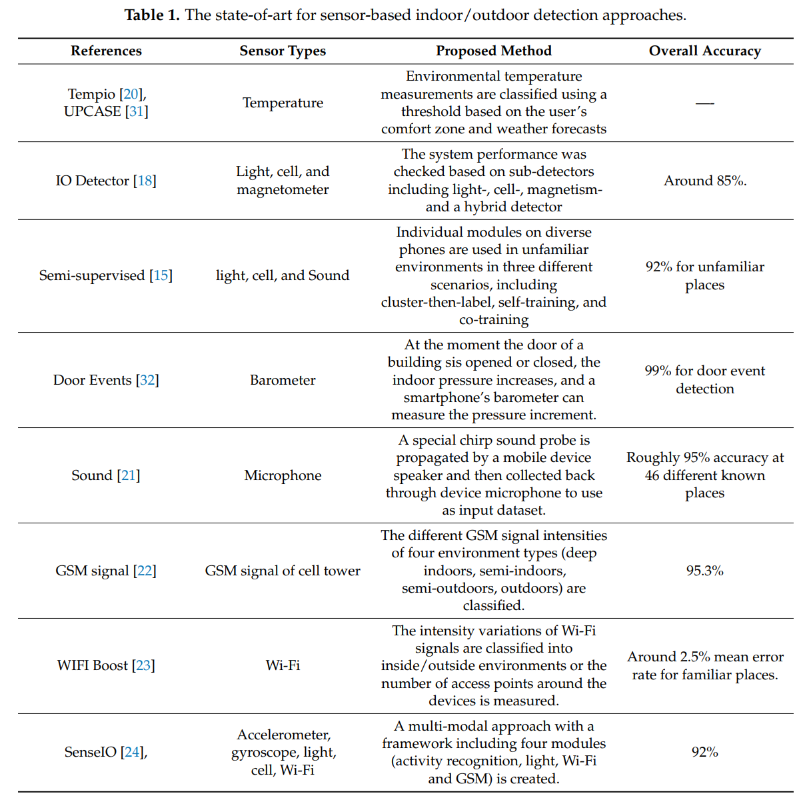

## 3. Design Criteria

* 简单，功能全面的包容性：环境检测过程应具有快速，易于使用的独立功能。 它不应该严重依赖硬件。 该方法可以扩展到其他智能设备，例如具有不同操作系统的智能手表和平板电脑，而无需安装新设施。
* 值得信赖：该方法应能够高精度确定环境类型，并且系统性能不应因依赖于不同的环境条件而降低。
* 能源消耗：由于该方法在移动平台上运行，因此它应该能够在工作日内最佳地管理移动设备的资源（例如电池，内存和处理器），避免快速耗尽智能移动设备的电量 。
* 瞬时：该方法应作为更高级别应用程序的集成服务组件提供。 因此，该方法应与环境变化一样快地做出响应。 检测阶段的任何延迟都可能降低移动应用程序的性能。
* 全面的可用性（一般可用性）：该方法应独立执行检测任务，即在没有环境先验知识的情况下，无需额外的硬件或特定的用户反馈即可确保所提出方法在各种高级应用程序中的全面性。

## 4. Methodology

室内外检测系统包括4个步骤：

1. 数据预处理：解析图元文件，重采样，降噪和数据分段任务。
2. 特征提取：提取不同的时域、频域和小波特征；
3. 特征选择：考虑基本特征的选择；
4. 分类：针对不同场景和评估因素下的随机森林分类器和AdaBoost分类器，检查了设计和测试过程中的环节并运行。

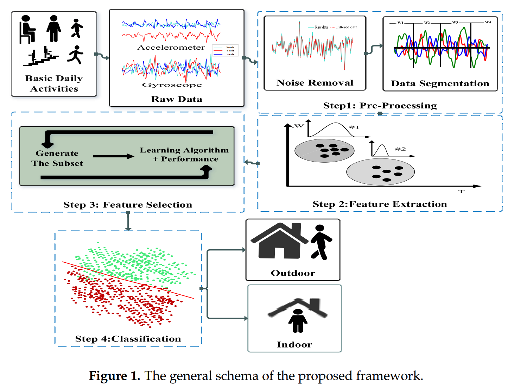

### 4.1 Dataset

数据集选取6种不同的活动方式：静止不动、跳跃、慢跑、走、上楼梯、下楼梯。

HASC2016数据集采集了320男性和120女性数据。

传感器：气压计、陀螺仪、地磁计、光线传感器等。在本文中只使用**气压计和陀螺仪**数据。

每个智能手机传感器都收集在一个简单的CVS文件中，该文件带有一个包含受试者详细信息的图元文件。 每个图元文件都包含主题的ID，性别，年龄组，身高（cm），体重（kg），终端位置，终端类型，终端ID，终端安装状态（固定或自由），操作系统类型，采样率，位置（ 室内或室外），地板类型和鞋类类型。

### 4.2 Data Pre-Processing

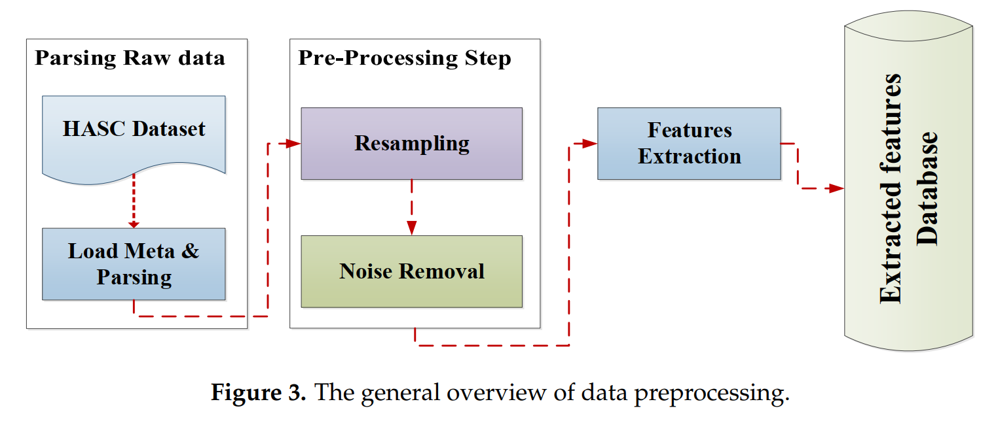

#### 4.2.1 Noise Removal

常见的滤波方法：低通滤波、高通滤波、卡尔曼滤波、加权平均（WMA）、moving average filters和平滑算法。

由于输入数据集是智能手机用户通过其运动传感器检测到的日常活动，因此在每个加速度计和陀螺仪上使用截止频率等于20 Hz的三阶低通巴特沃斯滤波器和中值滤波器（N = 3）。截止频率设置为20 Hz，因为该速率足以捕获人体运动，因为只有百分之一的能量高于15 Hz。此外，为了提高准确性并减少不确定性，已删除每个传感器数据文件的前两秒和后五秒，以跳过数据的初始化和终止行为。

 #### 4.2.2 Data Segmentation

对于大多数机器学习方法而言，长期数据流不能以训练或测试数据的形式直接使用，因此需要将此连续数据分为许多短数据流。 time-window slide segmentation方法是将长期信号转换为短期信号的常规方法。由于来自降噪步骤的滤波数据仍然很长，因此我们通过应用重叠的时间窗口将其分割为许多短片段。 每个时间窗口为2 s，而重叠率为50％。

### 4.3 Feature Extraction

智能移动设备可以位于不同的位置，包括在用户身体上或由用户携带的包内。为了覆盖这种多样性，已经提出了从时域，频域和小波域提取的216种不同特征。 这些域通常已用于基于智能手机运动传感器的人类活动识别系统。表2和3展示了被提出特征的细节，其中包括特征标签、公式和简单的描述。

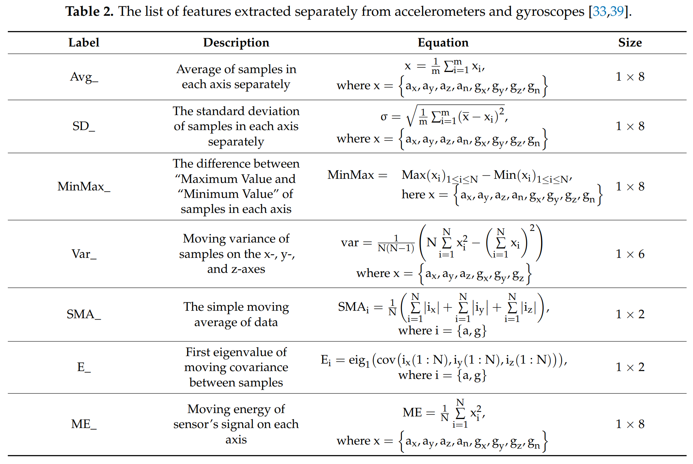

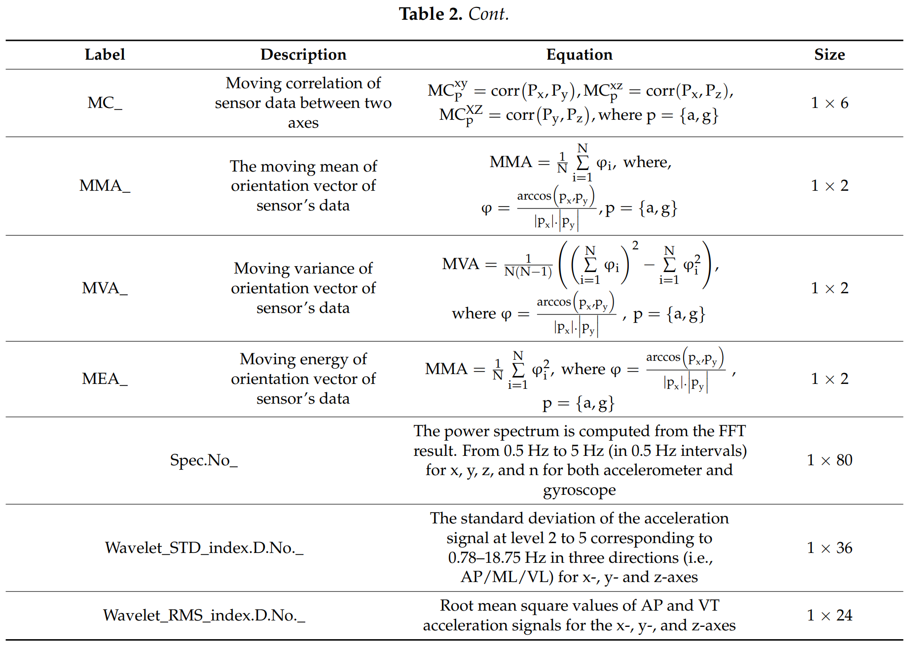

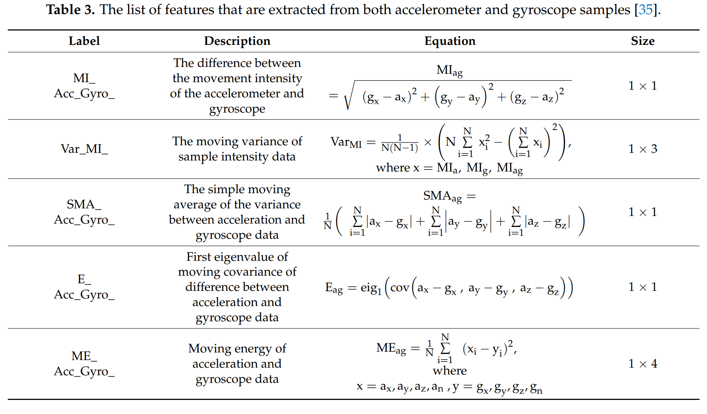

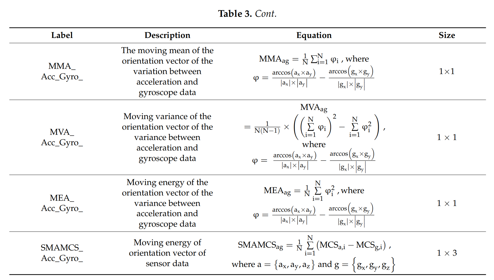

### 4.4 Feature Selection

由于不同的搜索策略，特征选择方法通常可以分为三种方法：过滤器，包装器和嵌入式方法。通常，过滤器方法选择数据的常规属性以选择特征子集，而不包括任何分类器。此外，包装方法需要预定义的学习算法，并将其准确性用作评估指标。例如，在[43]中，将支持向量机（SVM）应用于递归特征消除（RFE）以查找与癌症最相关的基因。嵌入式模型在模型构建过程中运行特征选择。

特征提取步骤产生了216维向量。使用带有随机森林（RF）分类器的递归特征消除方法[43]来找到从用户运动数据中提取的特征的最佳排名。

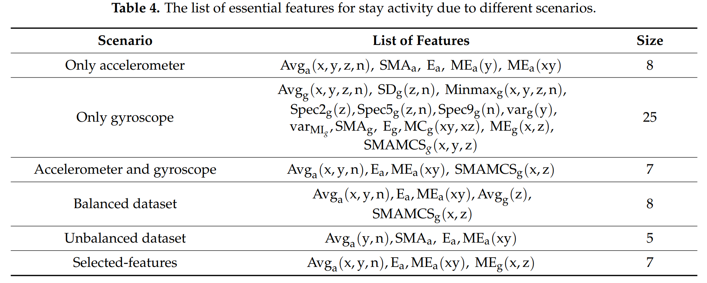

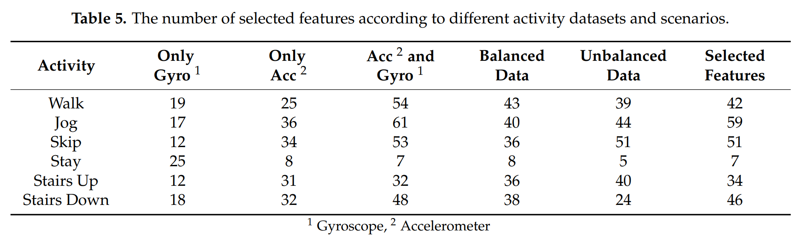

## 5. Classification

大多数常用分类器基本上都是二进制分类器（例如线性支持向量机，线性判别分析，最近邻，随机森林（RF），AdaBoost等）。 由于本研究将室内-室外检测问题定义为两类分类器问题，因此使用几个二进制分类器进行了实验研究。 根据性能分析，RF和AdaBoost的性能优于其他替代方案。 RF和AdaBoost是两种众所周知的集成分类方法。 它们的性能在解决过度拟合问题方面很强大，并且它们的超参数低，需要调整，而较少参数的调整和对噪声的鲁棒性是重要的实际方面。 

### 5.1 Random Forest(RF)

由于树的数量是RF中唯一的弹性参数，因此在我们的研究中将其调整为30，以实现较低的计算负担，同时获得较高的精度。

### 5.2 AdaBoost（ADA）

在对AdaBoost模型的最佳参数进行实验研究的基础上，估计数和学习率分别设置为600和0.1。

## 6. Model Evaluation and Results 

### 6.1 Training and Testing Procedure

为了评估检测方法的性能，我们通过使用从原始数据中提取的所有特征构建了训练和测试数据集，这些特征存储在数据库中，如第4.2节中所述。 在数据库上执行基于我们检测问题集的查询，并使用其标签构造数据矩阵。 改组后的矩阵分为两个子集，分别具有67％和33％的数据份额，分别用于训练和测试步骤。 我们注意到，整个数据集的类比在此划分之后可能有很小的差异。 对于每个特征，我们计算混淆矩阵并获得ROC图和精确召回图。 此外，还计算了所有类别的F分数和每个类别的平均F分数。

### 6.2 The Experimental Results

#### 6.2.1 Stability shift by sensors data fusion 

大多数智能手机具有两个集成的基本运动传感器：加速度计和陀螺仪。加速度计测量三维加速度数据，而陀螺仪则测量三维旋转速度数据。同样，人类活动由不同的旋转和过渡运动组成，需要对它们进行内部/外部环境检测。因此，能够提供足够数据以提高室内/室外检测精度为目的的传感器的选择，识别和利用至关重要。在本文中，已经描述了单传感器运动数据方案（仅加速度计或仅陀螺仪）与组合传感器（加速度计和陀螺仪）方案检测环境类型的性能。表6显示了有关六个不同活动类型数据集的室内/室外检测率的整体F分数。在此表中，我们可以在不同的输入感觉数据集上运行提出的模型后，比较所有观察到的结果。

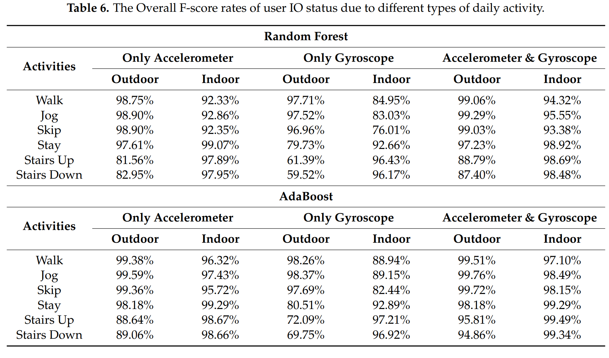

基于两个传感器的数据融合可以获得更好的结果。与室外检测结果相比，室内检测精度更高。

### 6.2.2 Impact of Unbalanced Data

公共数据集HASC2016非常不平衡，根据一下方法选择对象：

1. 对象必须参与所有活动
2. 对象必须同时具有加速度计和陀螺仪数据
3. 对象在每个类中的编号必须与在少数类中相同

图6a，b说明了在我们的模型评估方案中平衡和不平衡数据集的F得分的比较，以研究其对分类性能的影响。 结果表明，通过考虑上楼梯和下楼梯活动可以很好观察到的平衡问题，可以提高性能。 表7列出了平衡数据集与不平衡数据集对所建议模型的影响。

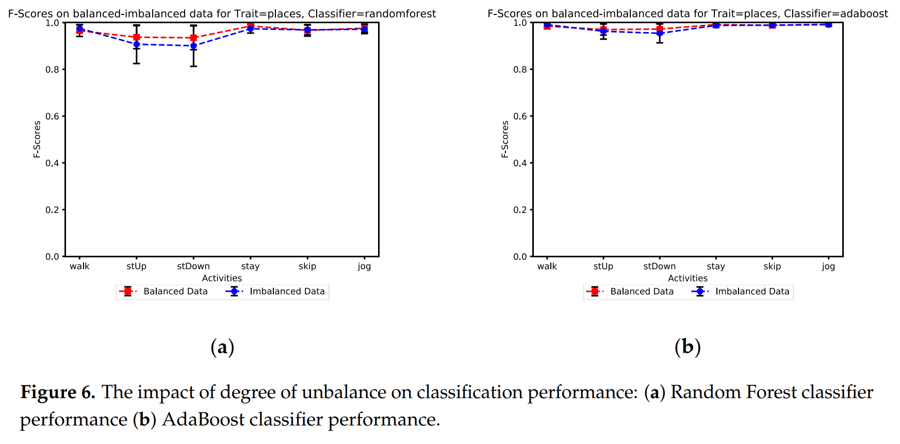

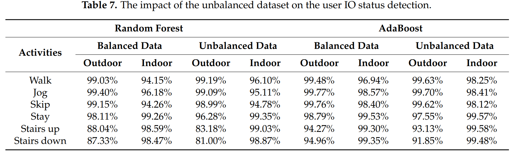

#### 6.2.3 Sensitivity to the Feature Selection 

为了找出所选特征对所有特征的影响，在这项研究中进行了一些测试。这不仅可以帮助减少特征向量的维数，而且还可以减少智能手机的功耗。