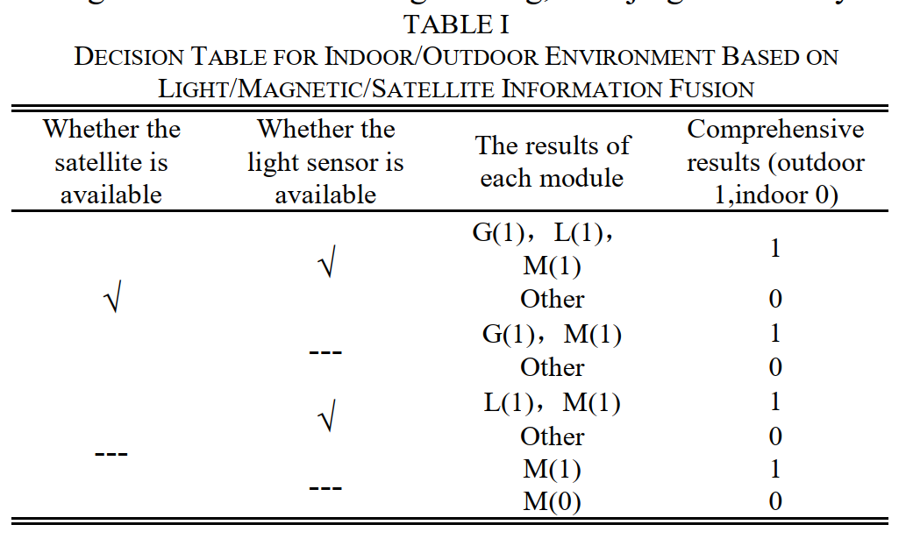
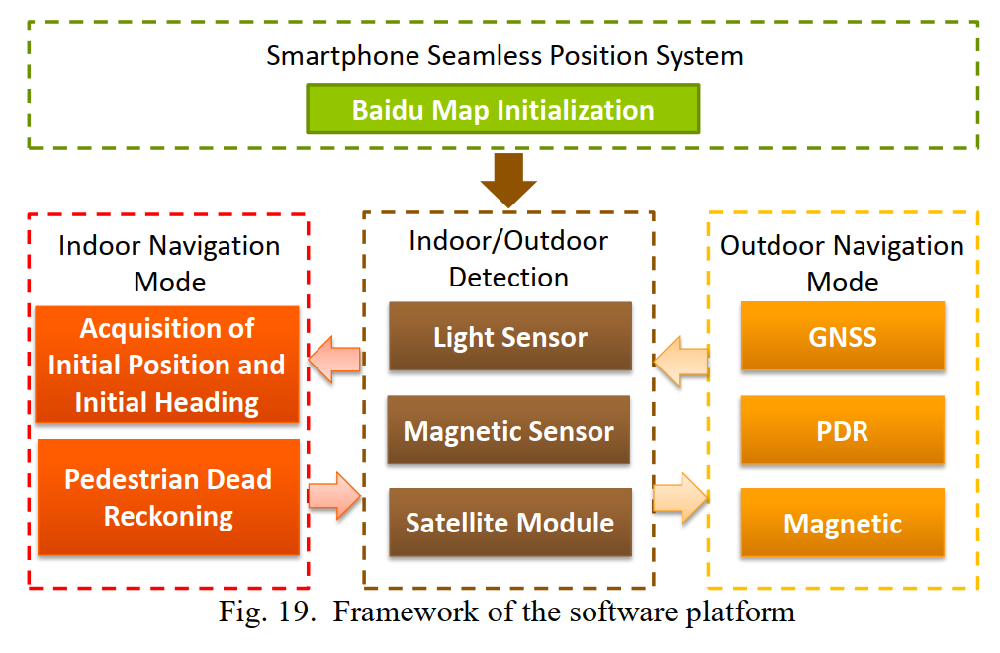

# Seamless Pedestrian Navigation Methodology Optimized for Indoor_Outdoor Detection

##  1. Introduction

文献Detecting indoor/outdoor places using WiFi signals and AdaBoost 提出了一种基于AdaBoost的二进制分类器，该分类器利用WIFI信号来推断室内/室外状况。

本文研究并实现了一种基于智能手机自包含传感器的方法。 智能手机的光传感器，磁传感器和GNSS模块用于识别室内/室外环境。 然后，提出了相应的导航算法来实现识别功能。 与GNSS的识别方法相比，本文的识别方法效率有所提高。 磁传感器，惯性传感器和GNSS用于室外融合定位。 对于室内定位，应用了基于MEMS加速度计和陀螺仪的PDR导航方法。 初始位置和姿态参数可以从移动图像传感器和室内电子地图的组合中获得。

## 2. INDOOR AND OUTDOOR ENVIRONMENTAL IDENTIFICATION STRATEGIES  
基于光传感器，磁传感器和GNSS接收器的环境识别算法如下。

### 2.1 A. Indoor and Outdoor Environmental Identification Algorithm Based on Light Sensor Information  

日光是白天室外环境中的主要光源。 太阳光强度比室内人造光强。 室内光强度明显低于室外光强度。 室内/室外亮度的明显差异可为两种环境识别提供基础。如果距离传感器的输出恒定为0，则表示智能手机已盖好，并且光线传感器不可用。

研究显示在室外环境中光强大于2000lux，同时GNSS检测到卫星数量大于10；在室内环境中，光强小于150lux，GNSS信号不可靠。

一般来说，光线强度大于2000lux就可以认为在室外，低于300lux就可以认为在室内。当智能手机移出建筑物时，光传感器的数据显着增加。 许多实验表明，可以选择500lux作为划分室内和室外环境的阈值。 因此，光传感器的值可用于室内和室外位置模式的自动切换。

### 2.2 Indoor and Outdoor Environment Recognition Algorithm Based on Magnetic Sensor Information  
对于复杂的建筑结构和室内的电气设备，室内的磁变化比室外的磁变化更剧烈。通常，在室外情况下，每秒磁传感器的总方差具有较小的输出噪声。 总方差的值小于3。在室内情况下，磁传感器的方差较大。 总方差的值大于5。经验结果表明，可以使用4作为区分室内和室外环境的合适阈值。

### 2.3 Indoor and Outdoor Environment Recognition Algorithm Based on Satellite Signal  

通常，GNSS信号的有效性由卫星号和HDOP值来判断。 本文结合行人导航的特点，从三个方面来验证GNSS信号：

1. GNSS接收信号是否有效；
2. HDOP和卫星数是否满足以下条件：HDOP <3（经验值），卫星数> = 4（定位算法至少需要4颗卫星）；
3. GNSS定位结果是否在人步行距离限制内。 从连续GNSS信号获得的距离应根据行人的步行速度加以限制。 考虑到噪声的影响，1秒内的距离应小于3米。 该值对步行者很有用，如果用于跑步者，则该值应更大。

### 2.4 Indoor and Outdoor Environment Recognition Algorithm Based on the Light/ Magnetic / Satellite Information Fusion  

以前的室内/室外环境识别算法，分别基于光传感器，磁传感器和GNSS信号，可以获得环境识别结果，但存在以下缺点：

1. 应该使用智能手机中的距离传感器来确定白天是否覆盖了光传感器。 覆盖时，不能将其用于室内和室外环境识别。
2. 磁传感器容易受到附近电子设备的影响。 它可能会报告错误的环境结果。
3. 智能手机的GNSS信息与不断变化的环境相比有一定的延迟。

因此，有必要研究一种光/磁/卫星信息融合算法，以进行准确，实时的室内/室外环境识别。 室内/室外确定方法的宽松判断将导致较大的误差，这将影响定位精度和导航稳定性。 本文在基于光/磁/卫星信息融合的室内/室外环境识别算法中采用了“与”逻辑判断。 仅当所有可用传感器都指示该模式时，才能确定室外模式。 卫星和磁传感器的信息将被引入扩展的卡尔曼滤波数据融合处理中，以减少定位误差。

## 3. Indoor Navigation Mode

### 3.1 Acquisition of the initial position and initial heading  

1. 智能手机照片的文本识别软件
2. 获取初始位置和初始航向

在开始导航之前，行人在起点拍摄门号码的图片。 借助从照片中获得的文字，可以识别初始位置信息并将其与室内地图数据库匹配。 可以确定相应位置的初始地理坐标。

行人通常在中国大陆的道路右侧行走，这意味着右侧的门号可以轻松捕获。 可以根据室内地图数据库结合走廊的方向来确定初始方向

### 3.2 IMU pedestrian dead reckoning algorithm  

#### 3.2.1 The step counting algorithm  

步长计数算法分为三类：峰值检测，过零检测和平坦区域检测。 前两个检测用于通过检测加速度的特殊值来对步数进行计数。 考虑到本文中智能手机的实时性要求，为步数计算算法选择了峰值检测方法。

在步行过程中，垂直加速度在一步循环内增加和减少。 因此，Z轴加速度的上升或下降间隔可用于计算步数。 尽管原始的Z轴加速度计输出具有一定的周期性，但会受到噪声的影响。 Z轴的输出周期很难用于直接计算步长。 需要对其信号进行滤波以尽可能消除噪声。

人的步频约为每秒1〜3步。 原始信号中有用信号的频率在1到5 Hz之间。 为了消除信号噪声，设计了带通滤波器以保留有用的信号。 数字FIR（有限脉冲响应）带通滤波器用于提取有用信号。

#### 3.2.2 Heading Angle Correction Algorithm  

陀螺仪可用于计算姿态角。 在短时间内具有高精度。 在步行过程中，陀螺仪的输出将受到身体摆动的影响。 为了获得良好的结果，每秒获得陀螺仪输出的平均值。 四元数用于实现智能手机中的实时导航解决方案。

#### 3.2.3 Calculation of Step length  

在本文中，使用GNSS校准方法来计算行人的步长。 步长等于距离除以步数。 在空旷的地方测量行人的步长，并获得平均步长以分析误差性能。 实际步长是在厘米级差分GNSS系统的帮助下计算的。 

## 4. OUTDOOR NAVIGATION MODE  

### 4.1 Two-dimensional elliptical calibration of magnetic sensor  

磁传感器的测量误差通常可以分为传感器误差和周围的磁误差。 传感器误差可以认为是器件比例因子，非正交误差，零误差等。 周围的磁误差可以看作是硬磁材料的磁误差和软磁材料的磁误差。 本文介绍了一种在线磁传感器校准方法。

### 4.2 PDR/GNSS/magnetic sensor outdoor positioning algorithm  

#### 4.2.1 Outdoor heading estimation  

步行方向的测量可以通过磁传感器实现。 磁传感器用于通过磁测量确定载体的绝对航向。 陀螺仪通常用作方位角测量传感器。 它具有短期的高精度性能。 在室外导航模式下，卡尔曼滤波算法通常用于在二维椭圆校准后融合磁传感器数据的过程，以实现准确的航向。

#### 4.2.2 Outdoor location estimation  

当GNSS可用时，尽量使用GNSS信号进行定位

#### 4.2.3 Positioning experiment based on PDR/magnetic/satellite information fusion

## 5. SMARTPHONE SEAMLESS POSITION SYSTEM DESIGN  

