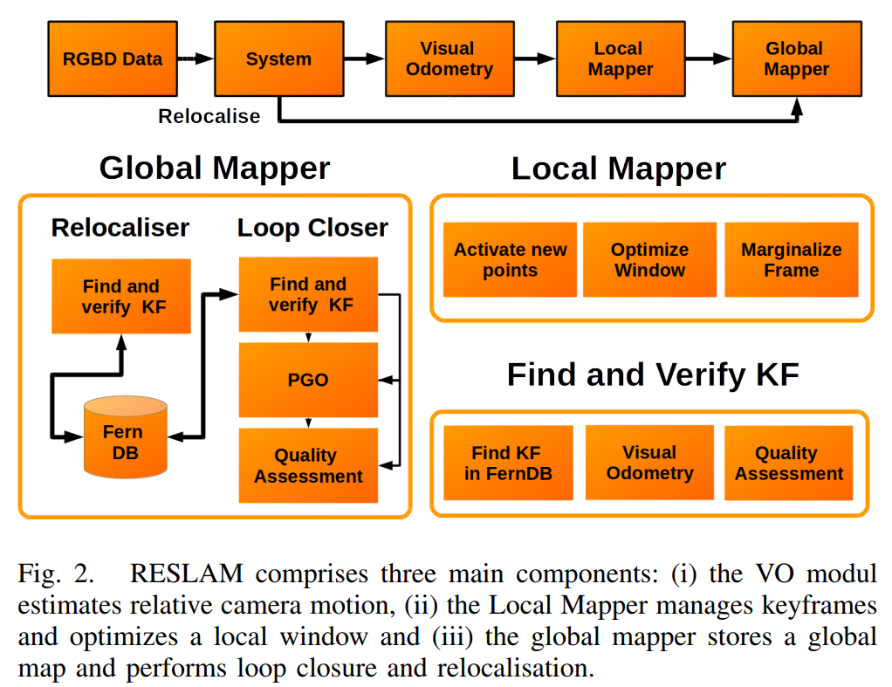
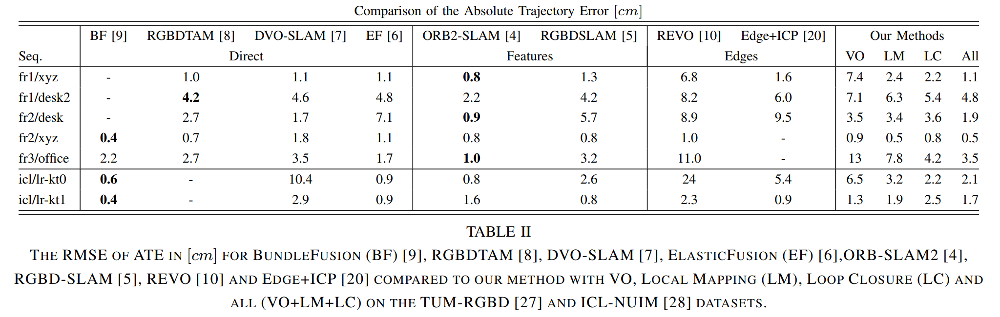
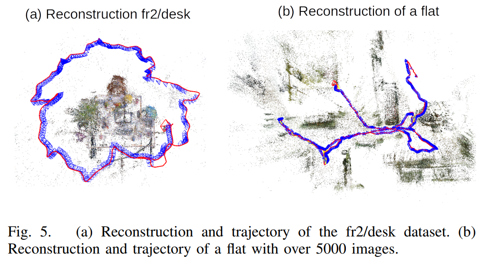

### RESLAM A real-time robust edge-based SLAM system

## Introduction

一般来说，视觉里程计只根据前N个关键帧来估计位姿，而没有保持全局图，通常这样会发生漂移。

Monocular SLAM 由于深度信息不够显著从而造成各种各样的限制。

RGBD SLAM可以分为两类：

 1. 特征点法
 2. 直接法

现在出现了一类新的方法，基于边缘对齐直接使用视觉里程计。这些基于边缘视觉里程计很有前景，但是没有一个完整的SLAM系统包含了回环检测和重定位。

在本文工作中提出里一套完整SLAM流程，全程利用边缘信息，在CPU上实现实时运行，主要贡献：

	* 一套基于边缘信息的SLAM系统，包含轨迹预测、回环检测和重定位；
	* 在多个关键帧上进行局部滑动窗口优化，以细化每个边缘的深度，相机校准参数和相机位姿；
	* 在多个基本数据集上实验，均得到质量不错的结果；
	* 在CPU上快速运行的SLAM系统；
	* 开源：https://github.com/fabianschenk/RESLAM  

## EDGE-BASED SLAM（RESLAM）

RESLAM是第一个基于边缘的SLAM系统，它可以优化边缘的深度，固有的摄影机参数，摄影机在局部窗口内的姿势，同时还可以在全局地图上执行回路闭合并提供重新定位功能。

### A.系统构建

RESLAM 主要部件运行再四个不同的线程：

1. 系统
2. 视觉里程计
3. 局部绘图
4. 全局绘图

将接受到RGBD数据输入到系统，通过一个预处理步骤检测边缘信息。然后视觉里程计模块预测当前帧与关键帧之间的位姿变换。然后将估计的位姿传到local Mapper去决定是否需要建立一个新的关键帧。如果新的关键帧建立，将它加入到局部窗口$k$提取边缘深度信息、相机位姿和相机参数。提取之后，回环检测将在已存在的数据库中搜索回环候选区。如果一个合适的候选区被找到，则闭合回环，另外将这一帧加入到数据库。如果系统以为某些帧在VO模块中失败导致系统停止相机位姿估计，系统将切换至重定位模块，所有新的RGBD帧将被送到重定位器代替VO直到重定位成功。

### B.相机模块

定义$t$时刻的图像为$I_t$，$t$时刻的深度图象为$Z_t$. 认为$I_t$和$Z_t$是同步的，$I_t$上的每个像素点$p = (x,y)$关联一个深度$Z = Z_t(p)$.

定义一个反投影函数$\pi^{-1}$来计算像素点$p$所对应的3D点$P$:
$$
P = \pi^{-1}(p,Z(p)) = (\frac{x-c_x}{f_x}Z,\frac{y-c_y}{f_y}Z,Z)
$$
同样的，$ \pi $是投影函数$ P $ to $ p $:
$$
p = \pi(P) = (\frac{xf_x}{Z}+c_x,\frac{yf_y}{Z}+c_y)
$$
最后，定义一个全卷函数$ \tau $用来计算在变换矩阵$\xi_{ji}$条件下帧$ F_i $中的点$p_i$在帧$F_j$中的重投影点$p'$:
$$
p' = \tau(\xi_{ji},p_i,Z_i(p)) = \pi(T_{ji}\pi^{-1}(p_i,Z_i(p_i)))
$$

## 基于边缘的视觉里程计（EBVO）

对于每一帧，检测Canny边缘同时计算与关键帧之间的相对变换$\xi_{ji}$，通过对齐他们各自检测到的边缘信息。为了对齐边缘，我们将有效深度$\epsilon_i$从$F_i$到$F_j$的边缘像素集重新投影，并尝试与$f_j$中检测到的最接近边缘对齐。在每次迭代中搜索最近的边缘通常非常缓慢，因此实践中不可行。由于边缘信息被检测到一次后不在发生改变，因此可以使用距离变换（DT）将欧几里德距离预先计算为每个像素位置的最近边缘。定义重投影边缘距离误差$E_{pi}$:
$$
E_{pi} = D_j(\tau(\xi_{ji},p_i,Z_i(p_i)))
$$
$D_j$代表$F_i$中的像素点$p_i$在$F_j$上的距离变换。通过设置所有边缘的深度$\epsilon_i$最小化边缘距离误差来对齐检测到的边缘$F_i$和$F_j$从而预测相机移动$\xi_{ji}^*$:
$$
\xi_{ji}^* = \underset{\xi_{ji}}argmin \underset{p_i\in\epsilon_i}\sum\delta_HE_{pi}
$$
$\delta_H$是一个可以降低大残差影响的Huber权函数。由于帧之间的边缘检测通常会不同，因此当$E_{pi} > \theta_e$时去掉潜在的异常值。

使用类似Lsd-slam中的迭代重新加权Levenberg-Marquardt方法，在从粗到精的方案中最小化了$\xi_{ji}^*$。大多基于边缘的方法，在每个金字塔层执行coatly边缘检测和距离变化估计。这将导致一个问题影响鲁棒性，因为在较小规模的层上纹理经常很平滑。文献20中解决这个问题通过一个边缘转换方法将高层中检测到的边缘信息复制到低层。

我们提出了一个不同的方法用来降低计算开支同时通过文献[20]中学到的办法解决鲁棒性问题。无需单独检测每个金字塔级别的边缘，我们仅检测边缘并显式计算最高级别的DT。然后将边缘通过相机内联函数重投影到低层。为了从最高到第二高，我们在投影函数π中将内在函数除以2。通过降低分辨率$D_{N-1}$，我们还避免了在金字塔每层$D_N$上进行距离变换重计算消耗。我们将$D_{N-1}$的4个像素块上的平均值作为$D_N$，然后除以2，因为像素之间的距离在各级别之间减半：
$$
D_N(x,y) = 0.5\frac{1}{N_p}\sum_{i=0}^1
\sum_{j=0}^1D_{N-1}(2x+i,2y+j)
$$
其中$N_p$是高分辨率中patch的size。当使用计算上更昂贵的机器学习边缘检测器时，仅检测一个级别的边缘的方法的优势就显而易见了。

1. 运动估计：为了优化$\xi^*_{ji}$，初始化$\xi_{ji}$很重要。尤其是相机相距较远是，仅从身份开始可能会导致收敛速度变慢，收敛到局部最小值或精度较低。为了避免这个问题，我们对$\xi^0_{ji}$估计5个不同的初始值：
   1. no motion from the last KF $F_i$
   2. no motion from the last frame $F_j$
   3. constant
   4. double
   5. half motion based on the motion from $F_{j-1}$ to $F_{j-2}$ and choose the one with the lowest cost.
2. 对齐失败：如果我们无法成功对齐新框架（这可能是由于传感器被部分或完全覆盖，非常激进的运动或反射性或阳光照射的表面，无法估计深度），则将系统切换到重新定位模式。本文使用两种方法去推测对齐失败：
   1. 如果小于$\theta_{NE}$个有效边缘；
   2. 边缘的平均重投影误差大于$\theta_{reproj}$

## Local Mapping

相比之前基于边缘的系统，他们通常使用当前帧与上一关键帧预测位姿，或针对其他几个关键点优化最近几个位姿，而本文方法是在先前关键点的窗口$K$上进行优化。在$K$中，提取所有边缘的深度、相机位姿和相机内联函数。请注意，在整个工作过程中，我们依赖于逆深度参数化，并且仅使用足够的基线细化点的深度，否则将其保持固定。滑动窗口的整体误差：
$$
E_K = \sum_{i \in K} \sum_{e \in A_i}\sum_{j \in k,j\neq i} \delta_Hr
$$
其中$\delta_h$是另外的Huber加权函数。根据当前状态估计值评估残差r，与$E_{pi}$不同的是，残差r还包括游湖的相机本征$C$和反深度$\rho_i$:
$$
r=D_j(p'(\xi_i,\xi_j,\rho_i,C))
$$
其中$p'_i$是$p_i$到$F_j$的重投影。

用高斯牛顿法优化最小化$E_K$类似于参考文献23，24：
$$
H=J^TWJ \qquad b=J^TWr
$$
其中$W\in \mathbb{R}^{n \times n}$是一个对角加权矩阵，$r \in \mathbb{R^n}$是堆积残差，$ J \in \mathbb{R}^{n \times d} $是$r$的雅各比矩阵。由于在窗口上进行优化的计算量很大，因此必须使用并管理一组减少的活动边缘。

### a. Edge Management

在窗口中的关键点，具有一组约10k-20k的具有有效深度$\epsilon$的检测边缘像素。由于深度的初始化是RGBD传感器提供的，这个集合明显大于单目相机，在单目相机中，仅具有已估计深度的点才有意义。然而在实时的CPU上不可能优化所有的关键帧中的边缘$K$。因此受文献“Direct sparse odometry ”启发，我们维护关键帧中一系列活动的边缘$A_i$来优化$K$。相对比“Direct sparse odometry ”，我们没有限制活动边缘的大小，而只对关键帧中的$K$的数量做了限制。

每当在窗口中加入一个新的关键帧$F_n$，就需要去掉一个旧的关键帧。为了保持边缘利于构建，我们为$F_n$维持一个距离map $M_n$。首先将每个活动的边缘$A_i$重投影到$F_n$，如果达到以下条件则激活边缘：$D_n(p') < \theta_A$ and $M_n(p') > \theta_M$，如果边缘被激活，则将其插入到distance map $M_n$。结束重投影所有的活动边缘$A_i$之后，尝试去激活新的边缘。

### b. Keyframe Management

在全局地图中维持合适数量的关键帧这对整个系统的性能和精确度都很重要。

1. Keyframe Creation：在一开始创建很多关键帧（5-15帧\每秒）然后根据文献[4]和[23]中的方法进行选择。（文献4: orb-slam2; 文献23: Direct sparse odometry  (DSO))。这样大大的加速了之后的全局地图的计算。

   在整个流程中我们计算三个度量值：i）均方光通量$C_{fov}$用来衡量视野变化；ii）没有旋转的平均流$C_{occ}$用来测量遮挡；iii）重投影边缘$p'$的数量：
   $$
   C_{fov} = \sqrt {\frac{1}{n}\sum ||p-p'||_2^2}, \qquad C_{occ}=\sqrt{\frac{1}{n}\sum ||p - p^t||_2^2}.
   $$
   当满足：
   $$
   C_{fov} + C_{occ} > 1 \quad or \quad N_{in }< 2N_{out}
   $$

2. Keyframe Marginalization：当$k$的大小被限定，那么在加入一个新的关键帧时就需要移除一个关键帧。维持最新的两帧同时计算一个距离评分$s_i$确保他们在3D空间中均匀分布:
   $$
   s_i = \sqrt{d_{i,1}} \sum_{j \in [2,n]/i} \frac{1}{d_{i,j}+\epsilon}
   $$
   $d_{i,j}$是$F_i$到$F_j$的欧氏距离。当边缘化一个关键帧时，将其与其他所有关键帧之间的相对转换存储在$K$中，因为这些相对转换稍后将表示循环闭合期间生成的姿势图中的一条边。为了防止活动变量实际上难以处理，我们使用Schur补码使旧变量边缘化。

## Global Mapper

Global Mapper 维护一个场景global map同时将关键帧存储在一个Fern数据库中去执行回环检测和重定位。

### a. Loop Closure

回环检测所面临的挑战：

1. 找到回环候选区；
2. 估计修正位姿；
3. 验证回环正确性。

找到回环候选区参照文献“Real-time rgb-d camera relocalization via randomized ferns for keyframe encoding  ”

### b. Relocalisation

在场景的大部分没有足够的纹理进行边缘检测或深度信息丢失的情况下，例如 由于阳光直射或传感器被完全或部分覆盖，可能会发生跟踪损耗。 这种情况需要重新定位步骤，我们要从以前看到的位置继续。 重新定位和循环闭合在找到先前见过的场景部分方面密切相关。两者访问相同的Fern数据库。 发现并验证重新定位的方式与验证循环闭合的方式相同。 重新定位成功后，从当前窗口中删除所有KF，然后从重新定位的位置重新启动系统。

## Implementation

系统环境：OpenCV for edge detection, distance transfoemcomputation and image input and output.

硬件环境：

* CPU：Intel i7-4790
* RAM: 32G

其他参数：

* RGBD：640 * 480 px
* Huber threshold $\theta_H = 0.3 $
* 移除每个金字塔等级上距离大于$\theta_e = 10,20,30 px$
* 跟踪次数$\theta_{NE} = 100$
* $\theta_{reproj} = 2.5 px$
* $\theta_{vis} = 0.05$%
* $\theta_{Hamming}=0.25$
* $\omega_i=[1,1,1.25,1.5]$

## Results and Discussion

测试数据库：TUM RGBD and ICL-NUIM

对比方法：1）Bundle Fusion；2）RGBDTAM；3）DVO；4）ElasticFusion；5）ORM-SLAM2；6）RGBDSLAM；7）REVO；8）ICP-based

如图可见，RESLAM方法优于同样基于边缘VO的方法，同时和其他方法有着相近的结果。相比与BundleFusion或者ElasticFusion，本方法不需要GPU，而是在CUP上做到了实时，同时效果差别不大。

定性的显示系统的稀疏重构和导航。

## 总结

提出了基于边缘信息VO的RESLAM系统，在CPU上做到了实时。

