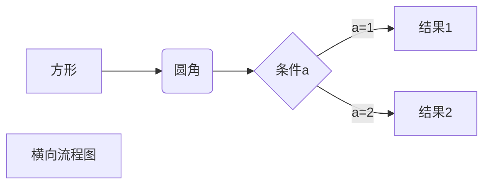

# 一级标题

## 二级标题

### 三级标题

#### 四级标题

##### 五级标题

###### 六级标题


*斜体文本*

_斜体文本_

**粗体文本**

__粗体文本__

***粗斜体文本***

___粗斜体文本___


***

*****

_ _ _

--------------------------


~~baidu.com~~

<u>xiahuaxian</u>


* 第一项

+ 第二项

- 第三项


1. 第一项
2. 第二项
3. 第三项


1. 第一项：
   1. 第一个元素
      1. 1.1.1


> 最外层
>
> > 第一层嵌套
> >
> > > 第二层嵌套


```c
#include<iostream.h>

void main(){
    printf("hello world!");
}

```


[百度](www.baidu.com)

<www.baidu.com>


| 表头 | 表头 |
| ---- | ---- |
|      |      |
|	|	|	|

### 公式

当你需要在编辑器中插入数学公式时，可以使用两个美元符 $$ 包裹 TeX 或 LaTeX 格式的数学公式来实现。提交后，问答和文章页会根据需要加载 Mathjax 对数学公式进行渲染。如：

### 流程图

1. 横向流程图

~~~latex

~~~


## 高级技巧

<https://www.runoob.com/markdown/md-advance.html>

